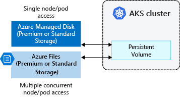
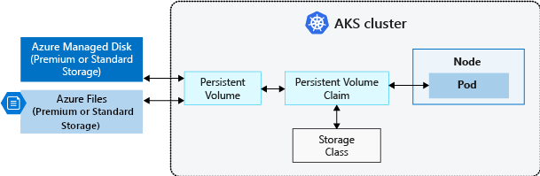
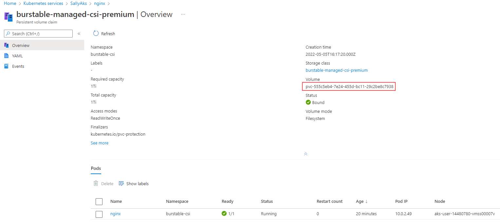
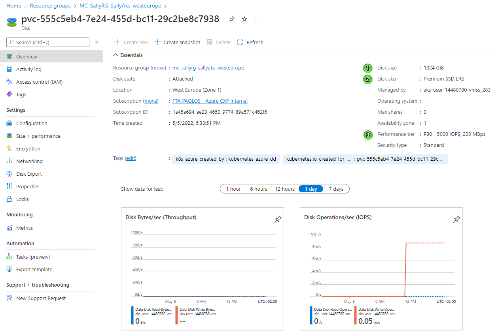
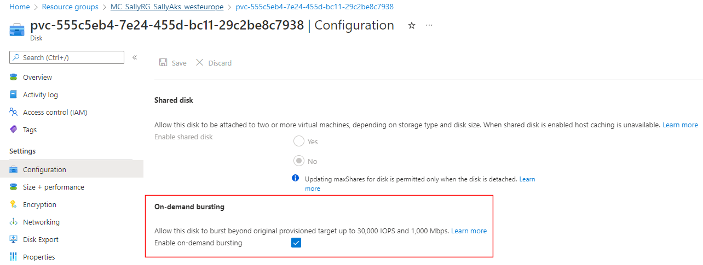

# Create a Burstable Managed CSI Premium Storage Class

This sample shows how to create a custom storage class that uses [Azure Premium LRS](https://docs.microsoft.com/en-us/azure/virtual-machines/disks-types#premium-ssds) to dynamically create an [Azure burstable managed disk](https://docs.microsoft.com/en-us/azure/virtual-machines/disk-bursting) as a [persistent volume](https://kubernetes.io/docs/concepts/storage/persistent-volumes/) using a [persistent volume claim](https://kubernetes.io/docs/concepts/storage/persistent-volumes/#persistentvolumeclaims) in [Azure Kubernetes Service](https://docs.microsoft.com/en-us/azure/aks/).

## Prerequisites

- For online deployments, you need an Azure account. If you don't have one, create a [free Azure account](https://azure.microsoft.com/free/?WT.mc_id=A261C142F) before you begin.
- Install [Visual Studio Code](https://code.visualstudio.com/download) to edit YAML manifests and bash script on your local machine.
- Install [Azure CLI](https://docs.microsoft.com/en-us/cli/azure/install-azure-cli) and [kubectl](https://kubernetes.io/docs/tasks/tools/) to run commands against your Azure subscription and AKS cluster.
- Run the bash script from a Linux/WSL/macOS terminal.

## Azure Managed Disk Bursting

Currently, as documented in [Managed disk bursting](https://docs.microsoft.com/en-us/azure/virtual-machines/disk-bursting), there are two managed disk types that can burst: [Premium SSDs](https://docs.microsoft.com/en-us/azure/virtual-machines/disks-types#premium-ssds) and [Standard SSDs](https://docs.microsoft.com/en-us/azure/virtual-machines/disks-types#standard-ssds). Other disk types cannot currently burst. There are two models of bursting for disks:

- An on-demand bursting model, where the disk bursts whenever its needs exceed its current capacity. This model incurs additional charges anytime the disk bursts. On-demand bursting is only available for premium SSDs larger than 512 GiB. . On-demand bursting needs to be explicitly enabled. For more information, see [Enable on-demand disk bursting](https://docs.microsoft.com/en-us/azure/virtual-machines/disks-enable-bursting?tabs=azure-cli).
- A credit-based model, where the disk will burst only if it has burst credits accumulated in its credit bucket. This model does not incur additional charges when the disk bursts. Credit-based bursting is only available for premium SSDs 512 GiB and smaller, and standard SSDs 1024 GiB and smaller.

Azure [Premium SSDs](https://docs.microsoft.com/en-us/azure/virtual-machines/disks-types.md#premium-ssds) can use either bursting model, but [Standard SSDs](https://docs.microsoft.com/en-us/azure/virtual-machines/disks-types.md#standard-ssds) currently only offer credit-based bursting. Consider increasing the [performance tier of your managed disks](https://docs.microsoft.com/en-us/azure/virtual-machines/disks-change-performance) if your workload would otherwise be always running in burst mode.

|  |Credit-based bursting  |On-demand bursting  |Changing performance tier  |
|---------|---------|---------|---------|
| **Scenarios**|Ideal for short-term scaling (30 minutes or less).|Ideal for short-term scaling(Not time restricted).|Ideal if your workload would otherwise continually be running in burst.|
|**Cost**     |Free         |Cost is variable, see the [Billing](#billing) section for details.        |The cost of each performance tier is fixed, see [Managed Disks pricing](https://azure.microsoft.com/pricing/details/managed-disks/) for details.         |
|**Availability**     |Only available for premium SSDs 512 GiB and smaller, and standard SSDs 1024 GiB and smaller.         |Only available for premium SSDs larger than 512 GiB.         |Available to all premium SSD sizes.         |
|**Enablement**     |Enabled by default on eligible disks.         |Must be enabled by user.         |User must manually change their tier.         |

## On-demand Bursting

Premium SSDs using the on-demand bursting model of disk bursting can burst beyond original provisioned targets, as often as needed by their workload, up to the max burst target. For example, on a 1 TiB P30 disk, the provisioned IOPS is 5000 IOPS. When disk bursting is enabled on this disk, your workloads can issue IOs to this disk up to the max burst performance of 30,000 IOPS and 1,000 MBps. For the max burst targets on each supported disk, see [Scalability and performance targets for VM disks](https://docs.microsoft.com/en-us/azure/virtual-machines/disks-scalability-targets#premium-ssd-managed-disks-per-disk-limits).

If you expect your workloads to frequently run beyond the provisioned perf target, disk bursting won't be cost-effective. In this case, we recommend that you change your disk's performance tier to a [higher tier](https://docs.microsoft.com/en-us/azure/virtual-machines/disks-performance-tiers) instead, for better baseline performance. Review your billing details and assess that against the traffic pattern of your workloads.

Before you enable on-demand bursting, understand the following:

- On-demand bursting cannot be enabled on a premium SSD that has less than or equal to 512 GiB. Premium SSDs less than or equal to 512 GiB will always use credit-based bursting.
- On-demand bursting is only supported on premium SSDs. If a premium SSD with on-demand bursting enabled is switched to another disk type, then disk bursting is disabled.
- On-demand bursting doesn't automatically disable itself when the performance tier is changed. If you want to change your performance tier but do not want to keep disk bursting, you must disable it.
- On-demand bursting can only be enabled when the disk is detached from a VM or when the VM is stopped. On-demand bursting can be disabled 12 hours after it has been enabled.

## AKS Storage Options

Applications running in Azure Kubernetes Service (AKS) may need to store and retrieve data from persistent volumes attached to the worker nodes. While some application workloads can use local, fast storage on unneeded, emptied nodes, others require storage that persists on more regular data volumes within the Azure platform. Kubernetes typically treats individual pods as ephemeral, disposable resources. Applications have different approaches available to them for using and persisting data. A volume represents a way to store, retrieve, and persist data across pods and through the application lifecycle.


Traditional volumes are created as Kubernetes resources backed by Azure Storage. You can manually create data volumes to be assigned to pods directly, or have Kubernetes automatically create them by declaring [persistent volume claim](https://kubernetes.io/docs/concepts/storage/persistent-volumes/#persistentvolumeclaims). Data volumes can use the following storage types: 

- [Azure Managed Disks](https://docs.microsoft.com/en-us/azure/virtual-machines/disks-types)
- [Azure Files](https://docs.microsoft.com/en-us/azure/storage/files/storage-files-planning)
- [Azure NetApp Files](https://docs.microsoft.com/en-us/azure/azure-netapp-files/azure-netapp-files-service-levels)
- [Azure Blobs](https://docs.microsoft.com/en-us/azure/storage/common/storage-account-overview)

For more information, see [Storage options for applications in Azure Kubernetes Service (AKS)](https://docs.microsoft.com/en-us/azure/aks/concepts-storage).

## Persistent Volumes

Volumes defined and created as part of the pod lifecycle only exist until you delete the pod. Pods often expect their storage to remain if a pod is rescheduled on a different host during a maintenance event, especially in StatefulSets. A *persistent volume* (PV) is a storage resource created and managed by the Kubernetes API that can exist beyond the lifetime of an individual pod. You can use Azure Disks or Files to provide the PersistentVolume. The choice of Disks or Files is often determined by the need for concurrent access to the data or the performance tier.



A PersistentVolume can be *statically* created by a cluster administrator, or *dynamically* created by the Kubernetes API server. If a pod is scheduled and requests currently unavailable storage, Kubernetes can create the underlying Azure Disk or Files storage and attach it to the pod. Dynamic provisioning uses a *StorageClass* to identify what type of Azure storage needs to be created.

## Storage Classes

To define different tiers of storage, such as Premium and Standard, you can use an existing [Storage Class](https://kubernetes.io/docs/concepts/storage/storage-classes/) or create your one. The StorageClass also defines the *reclaimPolicy*. When you delete the pod and the persistent volume is no longer required, the reclaimPolicy controls the behavior of the underlying Azure storage resource. The underlying storage resource can either be deleted or kept for use with a future pod. For clusters using the [Container Storage Interface (CSI) drivers](https://docs.microsoft.com/en-us/azure/aks/csi-storage-drivers) the following extra `StorageClasses` are created:

| Permission | Reason |
|---|---|
| `managed-csi` | Uses Azure StandardSSD locally redundant storage (LRS) to create a Managed Disk. The reclaim policy ensures that the underlying Azure Disk is deleted when the persistent volume that used it is deleted. The storage class also configures the persistent volumes to be expandable, you just need to edit the persistent volume claim with the new size. |
| `managed-csi-premium` | Uses Azure Premium locally redundant storage (LRS) to create a Managed Disk. The reclaim policy again ensures that the underlying Azure Disk is deleted when the persistent volume that used it is deleted. Similarly, this storage class allows for persistent volumes to be expanded. |
| `azurefile-csi` | Uses Azure Standard storage to create an Azure File Share. The reclaim policy ensures that the underlying Azure File Share is deleted when the persistent volume that used it is deleted. |
| `azurefile-csi-premium` | Uses Azure Premium storage to create an Azure File Share. The reclaim policy ensures that the underlying Azure File Share is deleted when the persistent volume that used it is deleted.|

Unless you specify a StorageClass for a persistent volume, the default StorageClass will be used. Ensure volumes use the appropriate storage you need when requesting persistent volumes.

> [!IMPORTANT]
> Starting in Kubernetes version 1.21, AKS uses CSI drivers only and by default. IN this case, the `default` storage class is `managed-csi`.

## Burstable Managed CSI Premium Storage Class

If you plan to use a P30 or higher managed disk and you want to enable on-demand bursting, you can't use the default `managed-csi-premium` storage class in your persistent volume claim as this storage class has on-demand bursting disabled by default. You need to build your own storage class, and explicitly enable the on-demand bursting using the corresponding [enableBursting](https://github.com/kubernetes-sigs/azuredisk-csi-driver/blob/master/docs/driver-parameters.md) parameter. This parameter enables on-demand bursting beyond the provisioned performance target of the managed disk. As mentioned above, on-demand bursting only be applied to Premium disk, disk size > 512GB, Ultra & shared disk is not supported. On-demand bursting is disabled by default, hence the default value of the [enableBursting](https://github.com/kubernetes-sigs/azuredisk-csi-driver/blob/master/docs/driver-parameters.md) parameter for the `managed-csi-premium` storage class is false. Hence, if you use this built-in storage class in you persistent volume claim, on-demand bursting on the created managed disk will be disabled.

You can create a custom storage class as follows using `kubectl` and make sure to enable on-demand bursting. The following example uses Premium Managed Disks and specifies that on-demand bursting is enabled by setting the [enableBursting](https://github.com/kubernetes-sigs/azuredisk-csi-driver/blob/master/docs/driver-parameters.md) parameter to `true`.

```yaml
apiVersion: storage.k8s.io/v1
kind: StorageClass
metadata:
  name: burstable-managed-csi-premium
provisioner: disk.csi.azure.com
parameters:
  skuname: Premium_LRS
  enableBursting: "true"
reclaimPolicy: Delete
volumeBindingMode: WaitForFirstConsumer
allowVolumeExpansion: true
```

> [!NOTE]
> AKS reconciles the default storage classes and will overwrite any changes you make to those storage classes.

## Persistent Volume Claims

A PersistentVolumeClaim requests storage of a particular StorageClass, access mode, and size. The Kubernetes API server can dynamically provision the underlying Azure storage resource if no existing resource can fulfill the claim based on the defined StorageClass. The pod definition includes the volume mount once the volume has been connected to the pod.



Once an available storage resource has been assigned to the pod requesting storage, PersistentVolume is *bound* to a PersistentVolumeClaim. Persistent volumes are 1:1 mapped to claims.

The following example YAML manifest shows a persistent volume claim that uses the newly created `burstable-managed-csi-premium` storage class and requests a 1TiB burstable Premium SSD.

```yaml
apiVersion: v1
kind: PersistentVolumeClaim
metadata:
  name: burstable-managed-csi-premium
spec:
  accessModes:
  - ReadWriteOnce
  storageClassName: burstable-managed-csi-premium
  resources:
    requests:
      storage: 1Ti
```

When you create a pod definition, you can specify:

- A persistent volume claim to request the desired storage.
- A *volumeMount* for your containerized application to read and write data from the persistent volume.

The following example YAML manifest shows how the previous persistent volume claim can be used to mount a volume at */mnt/azure*:

```yaml
kind: Pod
apiVersion: v1
metadata:
  name: nginx
spec:
  containers:
    - name: frontend
      image: mcr.microsoft.com/oss/nginx/nginx:1.15.5-alpine
      resources:
        requests:
          memory: "64Mi"
          cpu: "100m"
        limits:
          memory: "128Mi"
          cpu: "200m"
      volumeMounts:
      - mountPath: "/mnt/azure"
        name: volume
  volumes:
    - name: volume
      persistentVolumeClaim:
        claimName: burstable-managed-csi-premium
```

For mounting a volume in a Windows container, specify the drive letter and path. For example:

```yaml
...      
       volumeMounts:
        - mountPath: "d:"
          name: volume
        - mountPath: "c:\k"
          name: k-dir
...
```

## Run the Demo

You can run the following `deploy.sh` bash script to create the custom storage class, the persistent volume, and the pod that uses the persistent volume claim to create and mount a P30 managed disk as a volume.

```bash
#!/bin/bash

# Variables
namespace="burstable-csi"
persistentVolumeClaimTemplate="pvc.yml"
persistentVolumeClaimName="burstable-managed-csi-premium"
storageClassTemplate="sc.yml"
storageClassName="burstable-managed-csi-premium"
podTemplate="pod.yml"
podName="nginx"

# Create the storage class if doesn't already exists in the cluster
result=$(kubectl get sc -o jsonpath="{.items[?(@.metadata.name=='$storageClassName')].metadata.name}")

if [[ -n $result ]]; then
    echo "[$storageClassName] storage class already exists in the cluster"
else
    echo "[$storageClassName] storage class does not exist in the cluster"
    echo "creating [$storageClassName] storage class in the cluster..."
    kubectl apply -f $storageClassTemplate
fi

# Create the namespace if it doesn't already exists in the cluster
result=$(kubectl get namespace -o jsonpath="{.items[?(@.metadata.name=='$namespace')].metadata.name}")

if [[ -n $result ]]; then
    echo "[$namespace] namespace already exists in the cluster"
else
    echo "[$namespace] namespace does not exist in the cluster"
    echo "creating [$namespace] namespace in the cluster..."
    kubectl create namespace $namespace
fi

# Check if the persistent volume claim already exists
result=$(kubectl get pvc -n $namespace -o json | jq -r '.items[].metadata.name | select(. == "'$persistentVolumeClaimName'")')

if [[ -n $result ]]; then
    echo "[$persistentVolumeClaimName] persistent volume claim already exists"
    exit
else
    # Create the persistent volume claim 
    echo "[$persistentVolumeClaimName] persistent volume claim does not exist"
    echo "Creating [$persistentVolumeClaimName] persistent volume claim..."
    cat $persistentVolumeClaimTemplate | 
    yq "(.metadata.name)|="\""$persistentVolumeClaimName"\" |
    yq "(.spec.storageClassName)|="\""$storageClassName"\" |
    kubectl apply -n $namespace -f -
fi

# Check if the pod already exists
result=$(kubectl get pod -n $namespace -o json | jq -r '.items[].metadata.name | select(. == "'$podName'")')

if [[ -n $result ]]; then
    echo "[$podName] pod already exists"
    exit
else
    # Create the pod 
    echo "[$podName] pod does not exist"
    echo "Creating [$podName] pod..."
    cat $podTemplate | 
    yq "(.metadata.name)|="\""$podName"\" |
    yq "(.spec.volumes[0].persistentVolumeClaim.claimName)|="\""$persistentVolumeClaimName"\" |
    kubectl apply -n $namespace -f -
fi
```

## Azure Portal

Use the Azure portal to check the newly created pod:


Click the Volumes tab and then the persistent volume claim link to see the persistent volume claim.



Now open the managed disk resource under the node resource group of your AKS cluster:



In the overview page, you can observe:

1) Disk size: is 1024 GiB == 1 TiB
2) Disk sku: Premium SSD LRS
3) Performance Tier: P30 – 5000 IOPS, 200 MBps

As shown at [Premium SSD managed disks: Per-disk limits](https://docs.microsoft.com/en-us/azure/virtual-machines/disks-scalability-targets#premium-ssd-managed-disks-per-disk-limits), a P30 managed disk can burst up to 30,000 IOPS and 1,000 MB/sec. Now, if you click Configuration under Settings , you can see that on-demand bursting is enabled.



Premium SSDs using the on-demand bursting model are charged an hourly burst enablement flat fee and transaction costs apply to any burst transactions beyond the provisioned target. For more information about the cost model and some examples, see [billing](https://docs.microsoft.com/en-us/azure/virtual-machines/disk-bursting#billing).

## Next Steps

You can create custom storage classes and enable additional features in your persistent volumes. For example, you can use the [diskEncryptionSetID](https://github.com/kubernetes-sigs/azuredisk-csi-driver/blob/master/docs/driver-parameters.md) parameter to specify the resource id of the disk encryption set to use for enabling [server-side encryption of Azure managed disks](https://docs.microsoft.com/en-us/azure/virtual-machines/disk-encryption). For more information, see [Bring your own keys (BYOK) with Azure disks in Azure Kubernetes Service (AKS)](https://docs.microsoft.com/en-us/azure/aks/azure-disk-customer-managed-keys).

## Useful Links

- [Best practices for storage and backups in Azure Kubernetes Service (AKS)](https://docs.microsoft.com/en-us/azure/aks/operator-best-practices-storage)
- [Dynamically create and use a persistent volume with Azure disks in Azure Kubernetes Service (AKS)](https://docs.microsoft.com/en-us/azure/aks/azure-disks-dynamic-pv)
- [Manually create and use a volume with Azure disks in Azure Kubernetes Service (AKS)](https://docs.microsoft.com/en-us/azure/aks/azure-disk-volume)
- [Dynamically create and use a persistent volume with Azure Files in Azure Kubernetes Service (AKS)](https://docs.microsoft.com/en-us/azure/aks/azure-files-dynamic-pv)
- [Manually create and use a volume with Azure Files share in Azure Kubernetes Service (AKS)](https://docs.microsoft.com/en-us/azure/aks/azure-files-volume)
- [Integrate Azure HPC Cache with Azure Kubernetes Service](https://docs.microsoft.com/en-us/azure/aks/azure-hpc-cache)
- [Manually create and use an NFS (Network File System) Linux Server volume with Azure Kubernetes Service (AKS)](https://docs.microsoft.com/en-us/azure/aks/azure-nfs-volume)
- [Integrate Azure NetApp Files with Azure Kubernetes Service](https://docs.microsoft.com/en-us/azure/aks/azure-netapp-files)
- [Use Azure ultra disks on Azure Kubernetes Service](https://docs.microsoft.com/en-us/azure/aks/use-ultra-disks)
- [Enable Container Storage Interface (CSI) drivers for Azure disks and Azure Files on Azure Kubernetes Service (AKS)](https://docs.microsoft.com/en-us/azure/aks/csi-storage-drivers)
- [Use the Azure disk Container Storage Interface (CSI) drivers in Azure Kubernetes Service (AKS)](https://docs.microsoft.com/en-us/azure/aks/azure-disk-csi)
- [Use Azure Files Container Storage Interface (CSI) drivers in Azure Kubernetes Service (AKS)](https://docs.microsoft.com/en-us/azure/aks/azure-files-csi)
- [Azure Disk CSI driver for Kubernetes](https://github.com/kubernetes-sigs/azuredisk-csi-driver)
